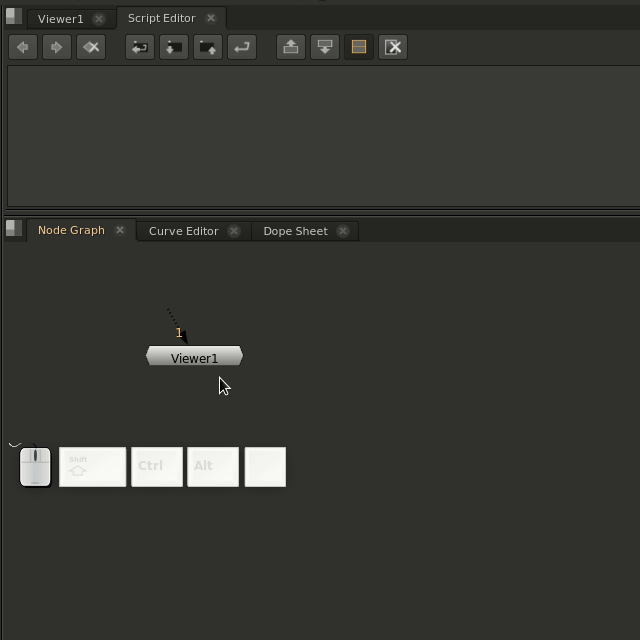

# ExtendedHotkeys for Nuke
ExtendedHotkeys is a quick plugins for the Foundry's Nuke application.

## What does it do
ExtendedHotkeys provides a new type of hotkey configuration into Nuke.  
It allows you to define a hotkey that does different things based on how many times you click it.  
  
For example, one of the artists I know plays StarCraft and is used to double tapping the `1` key to center his screen so he asked me to create him a hotkey that would center his node graph on whatever node his viewer was looking through.  
This provided easy enough because Nuke allows you to override the `1` hotkey.  
Unfortunately this will get rid of his ability to set his `1` input to a node and therefore renders the entire hotkey useless.  

I came up with a system that would allow him to press the `1` key once and have it work like normal but if he presses it twice in quick succession, it will instead execute the custom "center on node" function.

I later expanded this into a more generic system that would allow you to have as many extra functions as you want.  
That system is now **ExtendedHotkeys**



## How do I use it
If you load the extended_hotkeys `init.py` file, it will add itself to the `nuke` module as `nuke.addExtendedCommand`

You can then call it like this:
```python

def _print_quick():
    print("Wow! Such fast!")

def _print_second():
    print("You called the second hotkey!")

def _print_last():
    print("You made it to the last hotkey!")

toolbar = nuke.menu("Nodes").menu("Other")
nuke.addExtendedCommand(toolbar, "Special Command", [_print_quick, _print_second, _print_last], "v")
```

The `addExtendedCommand` function has a very similar spec to `nuke.Menu.addCommand`.
The main difference is the implicit first arg `self` must be passed in manually.
Other differences include:
  - `command` kwarg is now `commands` and can be a list too.
  - `timeout` has been added and is in ms.
```python
def addExtendedCommand(menu, name, commands, shortcut=None, icon=None, tooltip=None, index=None, readonly=None, shortcutContext=None, timeout=1000):
    """
addExtendedCommand(...)
    self.addCommand(name, command, shortcut, icon, tooltip, index, readonly) -> The menu/toolbar item that was added to hold the command.
    Add a new command to this menu/toolbar. Note that when invoked, the command is automatically enclosed in an undo group, so that undo/redo functionality works. Optional arguments can be specified by name.
    Note that if the command argument is not specified, then the command will be auto-created as a "nuke.createNode()" using the name argument as the node to create.

    Example:
    menubar = nuke.menu('Nuke')
    fileMenu = menubar.findItem('File')
    fileMenu.addCommand('NewCommand', 'print 10', shortcut='t')

    @param name: The name for the menu/toolbar item. The name may contain submenu names delimited by '/' or '', and submenus are created as needed.
    @param commands: Optional. The commands to add to the menu/toolbar. This can be a string to evaluate or a Python Callable (function, method, etc) to run or a list of either.
    @param shortcut: Optional. The keyboard shortcut for the command, such as 'R', 'F5' or 'Ctrl-H'. Note that this overrides pre-existing other uses for the shortcut.
    @param icon: Optional. An icon for the command. This should be a path to an icon in the nuke.pluginPath() directory. If the icon is not specified, Nuke will automatically try to find an icon with the name argument and .png appended to it.
    @param tooltip: Optional. The tooltip text, displayed on mouseover for toolbar buttons.
    @param index: Optional. The position to insert the new item in, in the menu/toolbar. This defaults to last in the menu/toolbar.
    @param readonly: Optional. True/False for whether the item should be available when the menu is invoked in a read-only context.
    @param shortcutContext: Optional. Sets the shortcut context (0==Window, 1=Application, 2=DAG).
    @param timeout: Optional. Only comes active if you pass multiple commands. Sets the timeout for our internal timer on your new hotkey. It's the total time between your first click to your last click to trigger all your callbacks for the hotkey.
    @return: The menu/toolbar item that was added to hold the command.
    """
```

## Helpers
There is also a helpers module provided with ExtendedHotkeys.  
It must be manually imported as a python module with `from extended_hotkeys import helpers`.
Helpers contains a few useful functions to aid in extending existing hotkeys.

### helpers.path_to_hotkey
    path_to_hotkey will take a string path in the form of <menu>/<menu>/<item> of any length where <menu> is the name of a Nuke menu and <item> is the resulting item you want to return.

    For example:
        ```path_to_hotkey("Nodes/Color/Grade")``` will return the menu item to create a grade.
    There are some special menu items you may not know about. 
      Check out ```nuke.hotkeys()``` to see them all.

    There is some special case work being done for the "Viewer/Input/<number>" hotkeys because they don't seem to be perfectly mapped to the menuItem.

    For reference:
        "Viewer/Input/<number>" will return the action that gets called when you press <number>.
### helpers.jump_to_input
    jump_to_input takes an input number and when called will center your viewer on whichever node your viewer is connected to at index <number>

    :param number: The 0 indexed number corresponding to the input you want
    :type number: int
    :return: A lazy function that will evaluate the input at index <index> when called.
    :rettype: types.FunctionType

### helpers.viewer_hotkey
    viewer_hotkey will return a types.FunctionType object that simulates pressing a number on your keyboard when you have a viewer.  
    **It is probably better to call `path_to_hotkey("Viewer/Input/<number>") instead of `viewer_hotkey(<number>)` because the former deals with turning the `1` on your keyboard into index `0` for the viewer.


## Contributing
Everyone is encouraged to contribute!
Especially people that are new to contributing on github!

I am specifically interested in reporting bugs or implementing any other "special edge cases" like the viewer hotkeys.
